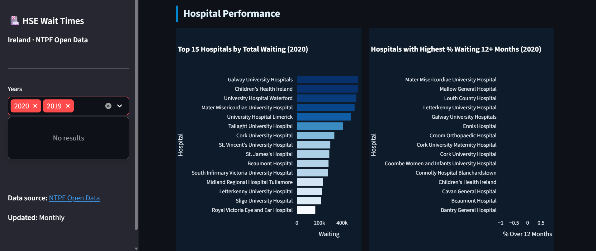
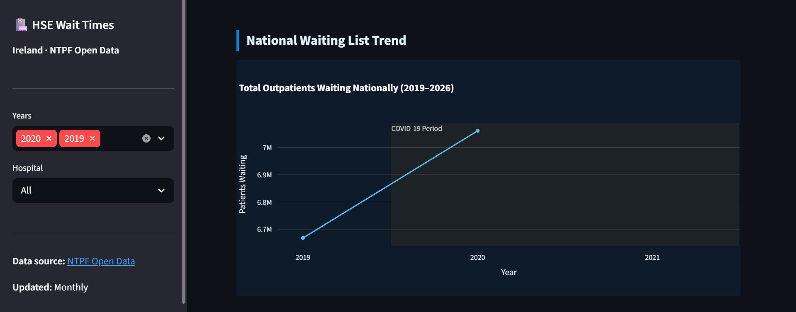
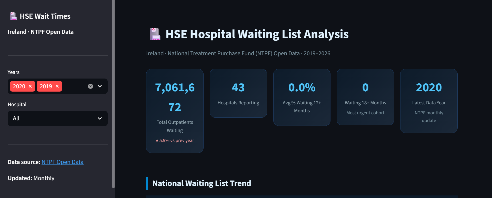
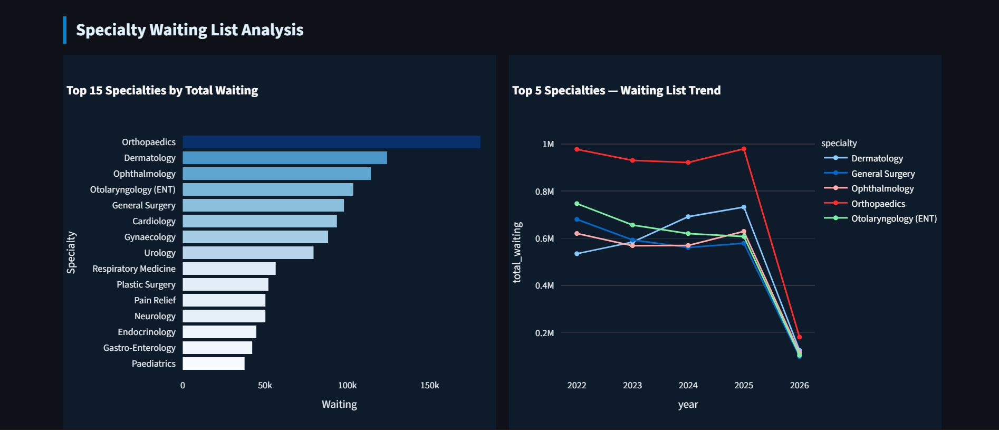
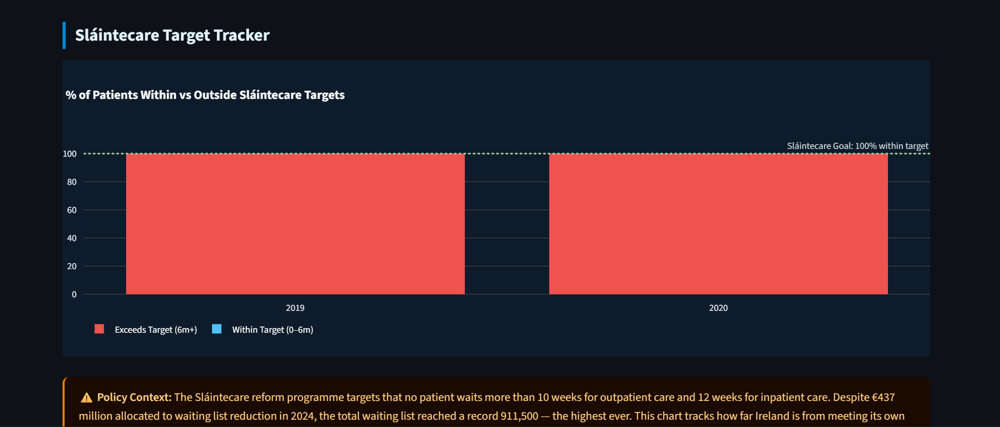
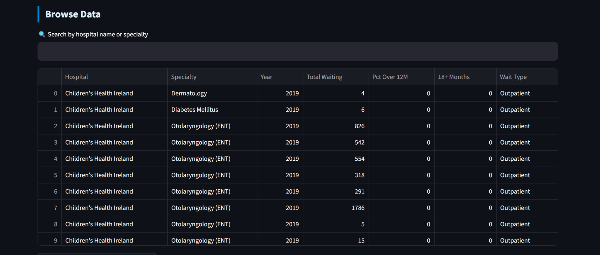

# 🏥 HSE Hospital Waiting List Analysis (2019–2026)

**Python · SQL · Streamlit · Plotly · Power BI** | Real NTPF Open Data · 50+ Hospitals · Monthly Updates

---

## Why I Built This

Over 911,500 people are currently on a public hospital waiting list in Ireland — the highest number ever recorded. I wanted to go beyond the headline and ask what the data actually shows: which hospitals are improving, which specialties are the real bottlenecks, and does spending more money actually help?

This project uses official NTPF open data — the same data used by RTÉ, the Irish Times, and the HSE itself — covering 8 years, 50+ hospitals, and monthly updates.

---

## Dashboard Screenshots

**Overview and KPIs**


**National Waiting List Trend (2019–2026)**


**Hospital Performance — Volume and Long Wait %**


**Specialty Analysis — Orthopaedics, Dermatology, ENT Lead**


**Sláintecare Target Tracker**


**Browse All Data — Searchable by Hospital and Specialty**


---

## Project Pipeline

```
NTPF Open Data (ntpf.ie)
        ↓
Python Downloader   →   30+ CSV files (2019–2026)
        ↓
Python Cleaning     →   3 unified analytical tables
        ↓
SQLite Database     →   17 analytical SQL queries
        ↓
Streamlit Dashboard + Power BI
```

---

## Tech Stack

| Tool | Purpose |
|---|---|
| **Python (requests, pandas)** | Downloaded 30+ CSVs from NTPF, handled inconsistent column names across 8 years, merged into 3 clean tables |
| **SQLite** | Stored cleaned data, wrote 17 queries using window functions, CTEs, year-on-year comparisons |
| **Streamlit + Plotly** | Interactive dashboard with hospital/year filters, trend charts, wait band analysis, Sláintecare tracker |
| **Power BI** | Secondary executive-style dashboard |

---

## Data Source

Official Irish government open data published monthly by the National Treatment Purchase Fund (NTPF).

- Source: [ntpf.ie/waiting-list-data/open-data](https://www.ntpf.ie/waiting-list-data/open-data/)
- Updated on the third Friday of every month
- Covers all public hospitals in Ireland
- Free to use and download

---

## Key Findings

**1. COVID Created a False Improvement That Masked the Real Crisis**
- Waiting lists appeared to fall in 2020–2021 — but this was not improvement
- Elective referrals collapsed as hospitals focused on COVID and patients stopped going to GPs
- When the system reopened, suppressed demand flooded back alongside 2 years of new cases
- The post-COVID surge is the same structural problem, now fully visible

**2. €437 Million Spent in 2024 — Waiting List Still Grew by 40,400**
- The government targeted a 6% reduction in 2024 with €437M allocated
- The list grew by 40,400 in the first six months alone
- This is a throughput problem, not just a funding problem — new referrals enter faster than patients are treated
- Spending more money into a broken pipeline does not fix the pipeline

**3. Orthopaedics, Dermatology, Ophthalmology and ENT Are Where the Crisis Lives**
- These four specialties dominate waiting list volumes across every year in the dataset
- High procedure volume, not life-threatening, but massive quality-of-life impact
- A person waiting 3 years for a hip replacement or cataract surgery cannot work or live independently
- The national waiting list crisis is concentrated in four under-resourced specialties

**4. The Sláintecare Target Has Never Been Close to Being Met**
- Sláintecare (2017) targeted no patient waiting more than 10 weeks for outpatient care
- The 0–6 month band has never been remotely close to 100% across 8 years of data
- The tracker shows most patients at any given point are beyond the target window
- The target was set without a credible plan to deliver it

**5. Hospital Performance Varies Far More Than Headlines Suggest**
- The national aggregate hides enormous variation at hospital level
- Some hospitals have reduced their 12+ month cohort year on year — others have worsened
- Size is not the determining factor — some large hospitals perform well, some small ones perform poorly
- The SQL scorecard in this project ranks every hospital by year-on-year change

---

## What Could Actually Fix This

Based on the data, five interventions stand out as most likely to have real impact:

- **Specialty-specific action** — Orthopaedics, Dermatology, Ophthalmology and ENT account for a disproportionate share of total waiting. Targeted capacity expansion in these four areas would outperform spreading resources across all specialties equally
- **GP-level triage reform** — Many outpatient referrals could be managed at primary care level with better GP resourcing and specialist telephone advice lines. Controlling the inflow is the only way to address demand
- **Extended and weekend theatre use** — Many theatres run at low utilisation on Friday afternoons and are unused at weekends. Extending operating hours for high-volume procedures like cataracts and joint replacements increases throughput without new infrastructure
- **Systematic NTPF referrals at 12 months** — Automatically triggering NTPF referrals when a patient crosses 12 months would specifically target the most urgent cohort. The mechanism exists but is applied inconsistently
- **Public hospital throughput data** — NTPF publishes how many people are waiting but not how many are being treated each month or what cancellation rates look like. Publishing this would create accountability that currently does not exist

---

## Getting Started

```bash
# Clone the repo
git clone https://github.com/Ishankasare/HSE-Hospital-Wait-Times-Analysis

# Install dependencies
pip install -r requirements.txt

# Step 1 — Download all NTPF data files
python src/download_data.py

# Step 2 — Clean and merge
python src/clean_data.py

# Step 3 — Launch dashboard
streamlit run src/dashboard.py
```

For SQL analysis — open DB Browser for SQLite (free), connect to `data/hse_waits.db`, run queries from `sql/analysis_queries.sql`.

---

## Project Structure

```
HSE-Hospital-Wait-Times-Analysis/
├── README.md
├── INSIGHTS.md
├── requirements.txt
├── .gitignore
├── src/
│   ├── download_data.py      ← downloads all NTPF CSVs (2019–2026)
│   ├── clean_data.py         ← cleans, merges, saves to SQLite + CSV
│   └── dashboard.py          ← Streamlit interactive dashboard
├── sql/
│   └── analysis_queries.sql  ← 17 analytical queries
├── data/
│   ├── raw/                  ← downloaded NTPF CSVs (gitignored)
│   └── processed/            ← cleaned tables (committed)
├── dashboard/
│   └── HSE-WaitTimes.pbix    ← Power BI dashboard
└── screenshots/
```

---

## What I Learned

- How to build a real pipeline from government open data — not a pre-cleaned Kaggle dataset
- Handling 8 years of inconsistently formatted CSVs with changing column names and restructured hospital names
- SQL window functions and CTEs on real time-series public health data to answer genuine policy questions
- How to frame analysis as a business story — every chart in this dashboard has a "so what", not just a number
- The difference between a data analyst and a data reporter is context: what the number means, why it happened, and what should be done about it

---

*Data: National Treatment Purchase Fund (NTPF) · ntpf.ie · Official Irish Government Open Data · Updated monthly*
